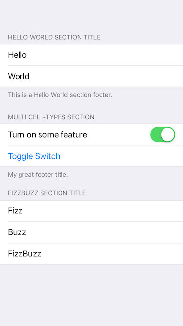

# Modular TableViewController

### Motivation
Creating a static `UITableViewController` is pretty straightforward but become really messy when you have a lot of sections.<br>
This sample project aims to solve that issue by providing a solution to delegate data source & delegate methods to section controllers without requiring another DSL.<br>
Having an object managing each section of the tableView brings you a lot of modularity.

This is what we're going to build:




## TableViewSectionDataSource & TableViewSectionDelegate protocols

Let's create the following protocols:

```swift
protocol TableViewSectionDataSource {

    var cellTypes: [UITableViewCell.Type] { get }
    var numberOfRows: Int { get }
    var headerTitle: String? { get }
    var footerTitle: String? { get }

    func registerCellTypes(in tableView: UITableView)
    func cellForRow(at indexPath: IndexPath, in tableView: UITableView) -> UITableViewCell

}

protocol TableViewSectionDelegate {

    func shouldHighlightRow(at index: Int, in tableView: UITableView) -> Bool
    func didSelectRow(at indexPath: IndexPath, in tableView: UITableView)
}
```

**Please note that I only added methods that I needed for that particular example, feel free to add any other needed method to each respecting protocols.**

Let's provide a default implementation to the  `registerCellTypes(in tableView: UITableView)` function, allowing us to easily register our cells in the tableView:

```swift
extension TableViewSectionDataSource {

    func registerCellTypes(in tableView: UITableView) {
        self.cellTypes.forEach { cellType in
            tableView.register(cellType, forCellReuseIdentifier: cellType.reuseIdentifier)
        }
    }
}
```
	
---

###  `TableViewController` boilerplate

Let's create a basic TableViewController:

```swift
class MyModularTableViewController: UIViewController {

    private let tableView: UITableView {
        return self.view as! UITableView
    }
    
    private let sectionControllers: [TableViewSectionDataSource] = []
        
    // MARK: - View Lifecycle

    override func loadView() {
        self.view = UITableView(frame: UIScreen.main.bounds, style: .grouped)
    }
    
    override func viewDidLoad() {
        super.viewDidLoad()
    
        // Register our cells
        self.sectionControllers.forEach { sectionController in
            sectionController.registerCellTypes(in: self.tableView)
        }
        self.tableView.dataSource = self
        self.tableView.delegate = self
    }
}
```

Then implement the `UITableViewDataSource` protocol so we can delegate everything to our section controllers:

```swift
extension MyModularTableViewController: UITableViewDataSource {

    func tableView(_ tableView: UITableView, numberOfRowsInSection section: Int) -> Int {
        return self.sectionControllers[section].numberOfRows
    }

    func tableView(_ tableView: UITableView, cellForRowAt indexPath: IndexPath) -> UITableViewCell {
        let sectionController = self.sectionControllers[indexPath.section]
        return sectionController.cellForRow(at: indexPath, in: tableView)
    }

    func numberOfSections(in tableView: UITableView) -> Int {
        return self.sectionControllers.count
    }

    func tableView(_ tableView: UITableView, titleForHeaderInSection section: Int) -> String? {
        return self.sectionControllers[section].headerTitle
    }

    func tableView(_ tableView: UITableView, titleForFooterInSection section: Int) -> String? {
        return self.sectionControllers[section].footerTitle
    }
}
```
    
## Bonus: type-safe cell dequeuing

`UITableView` requires providing a `String` for dequeuing a cell, which is really prone to typos.
Let's see how we can make it type-safe.

### `Reusable` protocol to the rescue
	
What if we could automatically provide a unique reuseIdentifier for every `UITableViewCell` classes and subclasses?<br>
Fortunately we can, with the help of a simple protocol and  `UITableViewCell` extension:

```swift
protocol Reusable {
    static var reuseIdentifier: String { get }
}

extension Reusable {
    static var reuseIdentifier: String {
        return String(describing: self) + "ReuseIdentifier"
    }
}

extension UITableViewCell: Reusable {}
```
    
Now every  classes and subclasses of `UITableViewCell` will automatically (thanks to our default implementation) have a unique `reuseIdentifier`, based on their name. 🙌🏻

To fully unleash the power of our `Reusable` protocol, we'll add an extension to `UITableView`:

```swift
extension UITableView {

    func dequeueReusableCell<T: UITableViewCell>(ofType cellType: T.Type, for indexPath: IndexPath) -> T {
        guard let cell = self.dequeueReusableCell(withIdentifier: cellType.reuseIdentifier, for: indexPath) as? T
        else { fatalError("Failed to dequeue cell of type \(String(describing: cellType)).") }

        return cell
    }
}
```
    
With that simple extension, we're now able to dequeue a cell by providing a type and not a string identifier, as a bonus, the function returns a cell with the correct type,
no more casting 🎉.

## SectionController Example

```swift
struct HelloWorldSectionController: TableViewSectionDataSource, TableViewSectionDelegate {

    var cellTypes = [UITableViewCell.self]

    var numberOfRows: Int {
        return 2
    }

    var headerTitle: String? {
        return "Hello World Section Title"
    }

    var footerTitle: String? {
        return "This is a Hello World section footer."
    }

    func cellForRow(at indexPath: IndexPath, in tableView: UITableView) -> UITableViewCell {
        let cell = tableView.dequeueReusableCell(ofType: UITableViewCell.self, for: indexPath)

        let texts = ["Hello", "World"]
        cell.textLabel?.text = texts[indexPath.row]
        return cell
    }

    func shouldHighlightRow(at indexPath: IndexPath, in tableView: UITableView) -> Bool {
        return false
    }
}
```

To include that section into your tableView, simply update your `sectionControllers` array like so:

```swift
private let sectionControllers: [TableViewSectionDataSource] = [ HelloWorldSectionController()]
```

## Wrap everything together

Check the `Example.playground` to see a live example.


